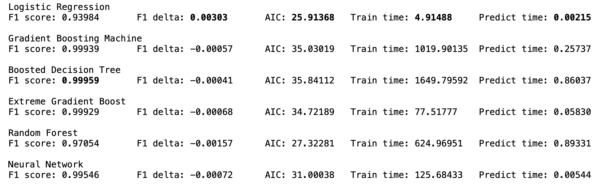

# Credit Card Fraud Detection
We will explore various models utilizing a credit card transaction data set from [Kaggle](https://www.kaggle.com/mlg-ulb/creditcardfraud) and evaluating which has the best performance metrics for classifying an incoming transaction as fraudulent or normal. The data set is provided by [The Machine Learning Group (MLG)](https://mlg.ulb.ac.be/wordpress/) of [Université Libre de Bruxelles (ULB)](https://www.ulb.be) and contains transactions made by european cardholders in September 2013.

The jupyter notebook walks readers through the end to end process of building machine learning models from exploratory data analysis, preprocessing, and variable relationship analysis to model creation and validation.  

## Models
* Logistic Regression
* Gradient Boosting Machine
* Boosted Decision Tree
* Extreme Gradient Boost
* Random Forest
* Neural Network

## Results
Based on the criteria of high precision, high recall, and fast predictions the Logistic Regression model performed best and was the only model that did not show signs of overfitting. 

